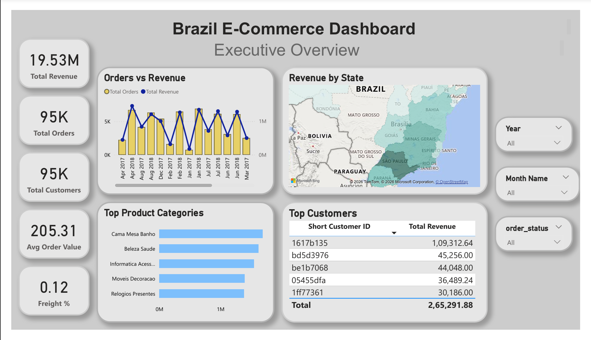

# 🇧🇷 Brazil E-Commerce Analytics Dashboard (Power BI)

## 📊 Project Overview
This project presents a professional **Power BI dashboard** built using a real-world Brazil e-commerce dataset.  

The goal is to analyze:
- Sales performance  
- Product behavior  
- Customer trends  
- Delivery efficiency  

The dashboard is designed for **business decision-making**, not just visualization.

---

## 🧩 Dashboard Structure

### 1. Executive Overview
- Total Revenue, Orders, Customers
- Average Order Value & Freight %
- Revenue trends over time
- Revenue distribution by state
- Top product categories and customers

---

### 2. Sales & Product Analysis
- Price vs Revenue relationship (scatter analysis)
- Revenue distribution across price ranges
- Category performance vs pricing
- Average order value trend (monthly)
- Revenue segmentation (low, mid, high price)

---

### 3. Delivery Performance
- Average delivery time analysis
- Monthly delivery trend
- Delivery performance by state (map)
- On-time vs late delivery breakdown
- Late delivery percentage tracking

---

## 📈 Key Insights

- Revenue shows consistent growth with seasonal fluctuations  
- Mid-to-high priced products contribute the majority of revenue  
- Certain states have significantly slower delivery times  
- ~38% of deliveries are slower than average  
- Delivery efficiency improved over time  

---

## 🛠️ Tools & Technologies

- **Power BI**
- **DAX (Data Analysis Expressions)**
- **Data Modeling (Star Schema)**
- **Data Cleaning & Transformation**

---

## 🧠 Data Model

- `orders` → central fact table  
- `order_items` → transaction details  
- `customers` → customer location  
- `products` → product/category info  

Relationships:
- One-to-many (correctly structured)
- Optimized for performance and accuracy

---

## 📁 Files

- `Brazil_Ecommerce_Analytics_Dashboard_PowerBI.pbix`

---
## 📸 Dashboard Preview

### Executive Overview

---

### Sales & Product Analysis

---

### Delivery Performance

---

## 🚀 How to Use

1. Download the `.pbix` file  
2. Open in Power BI Desktop  
3. Interact with filters and visuals  

---

## 🎯 Purpose

This project demonstrates:
- End-to-end dashboard development  
- Business-focused analytics  
- Clean UI/UX design in Power BI  
- Real-world problem-solving approach  

---

## 👤 Author

shravani sirimalle

---

## ⭐ If you found this useful
Consider giving a star to the repository!
